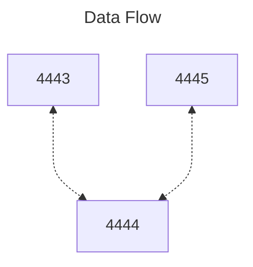
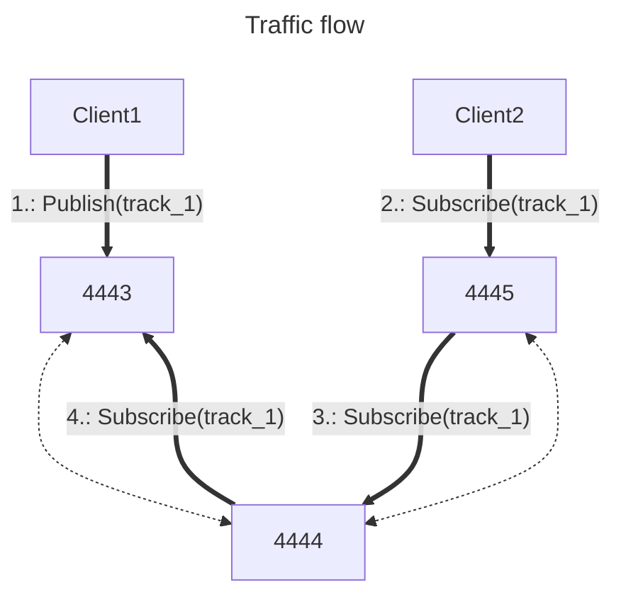

# Simple topo

```mermaid
---
title: Data Flow
---
flowchart TD
	4443 <-..-> 4444
	4445 <-..-> 4444

```

```mermaid
---
title: Traffic flow
---
flowchart TD
	4443 <-..-> 4444

	Client1 == 1.: Publish(track_1)   ==> 4443
	Client2 == 2.: Subscribe(track_1) ==> 4445
	4445       == 3.: Subscribe(track_1) ==> 4444
	4444     == 4.: Subscribe(track_1) ==> 4443

	4445 <-..-> 4444
```
